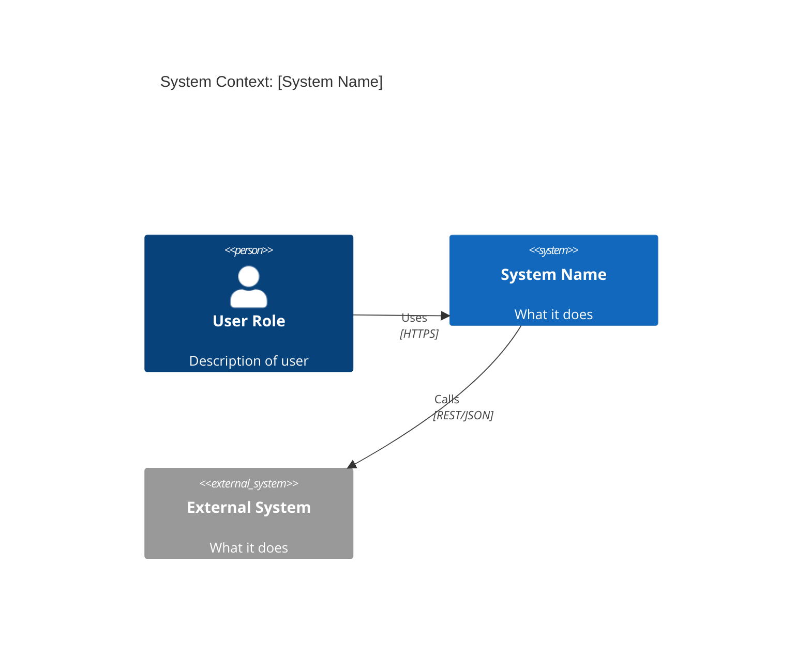
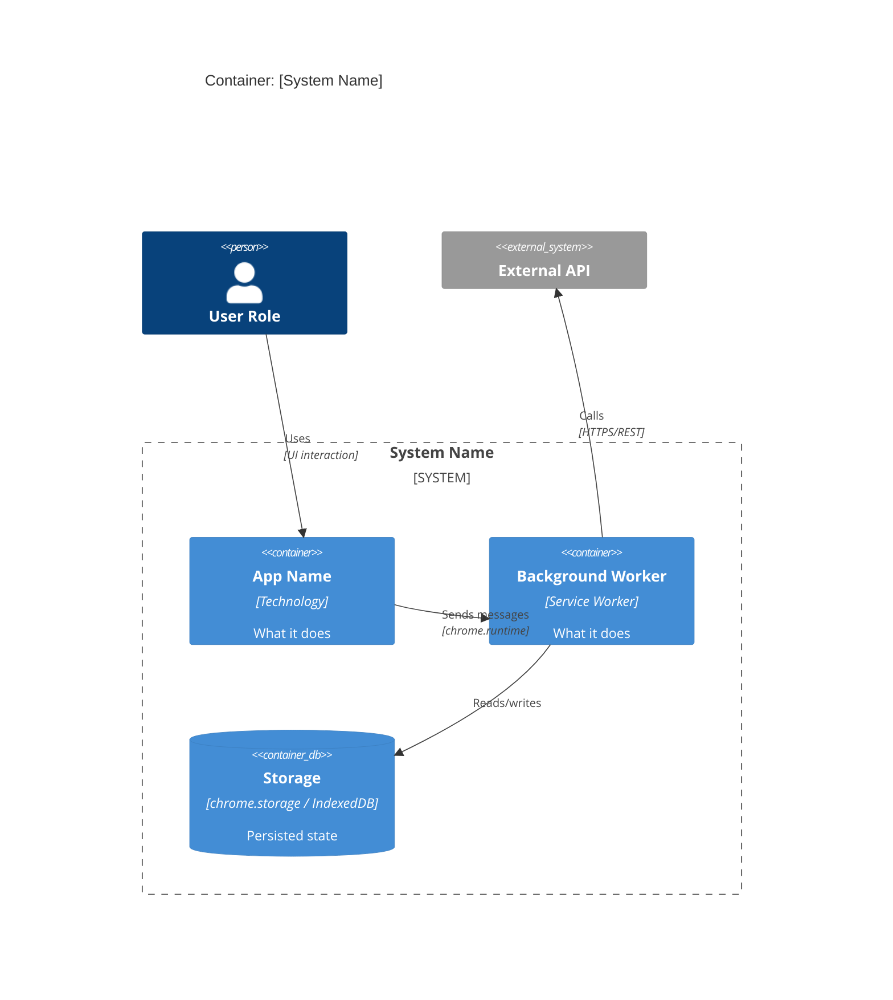
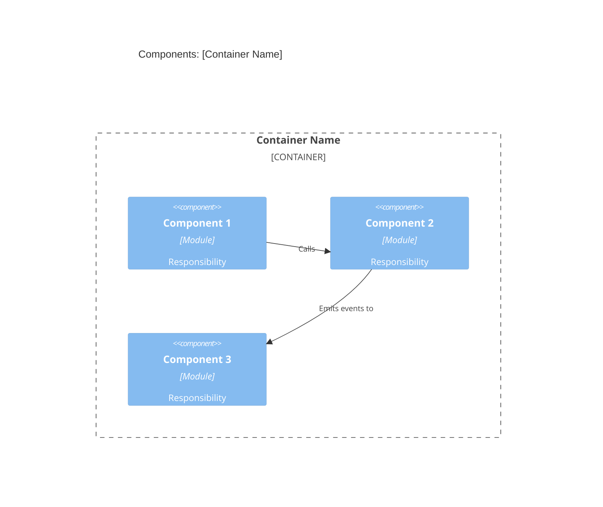
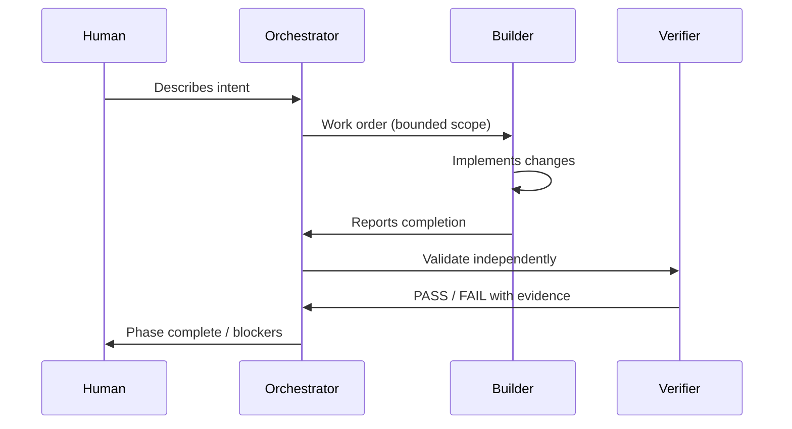
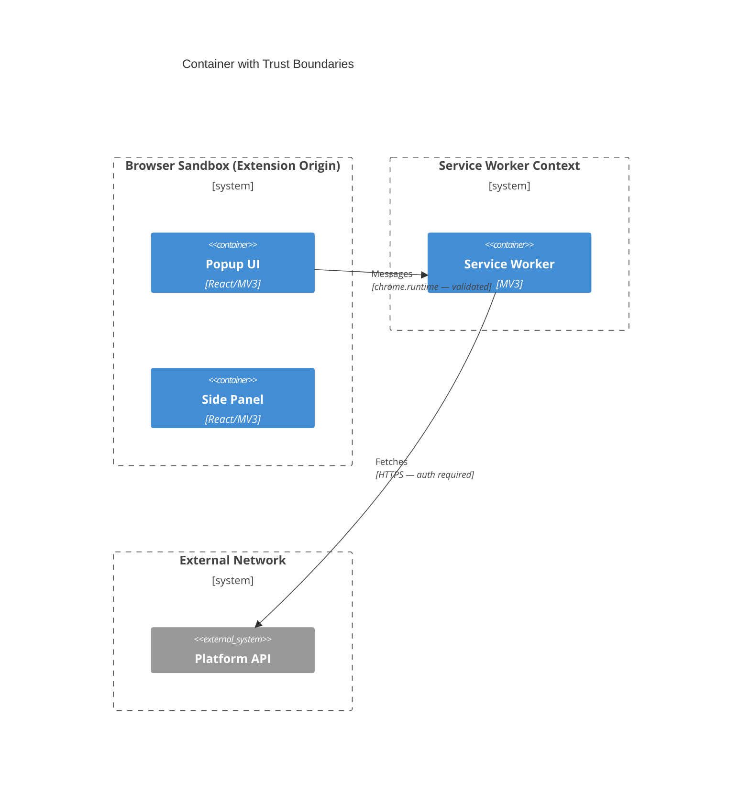

# C4 Diagram Generator

Generate C4 architecture diagrams using Mermaid syntax. Reference diagrams are in the project's `docs/diagrams/` directory.

## C4 Level 1 — System Context

Shows the system and its relationships to users and external systems.



**Required annotations:**
- Every `Person` entry = a real human stakeholder
- Every `System_Ext` = an external dependency (3rd party, platform API)
- `Rel` labels must include protocol where known

---

## C4 Level 2 — Container Diagram

Shows the major runtime units inside the system boundary.



**Required annotations:**
- Technology stack in each container
- Communication protocols on every `Rel`
- Storage type and what data category (public/internal/sensitive/regulated)

---

## C4 Level 3 — Component Diagram

Shows modules within a single container.



---

## C4 Level 4 — Dynamic / Sequence Diagram

Shows execution flow for a specific scenario.



---

## Trust Boundary Annotations

Add trust boundary overlays to container and context diagrams:



**Trust boundary rules:**
- Every cross-boundary `Rel` must label auth/validation mechanism
- Boundaries must align with Chrome extension privilege scopes where applicable

---

## Diagram Storage
Save diagrams to: `docs/diagrams/[system]-[level]-[date].mmd`

---

## Output Section for Intent Packet

When producing diagrams as part of `define-intent`, format output as:

```markdown
## Architecture Diagrams

### System Context (C4 L1)
\`\`\`mermaid
[diagram here]
\`\`\`
**Saved**: `docs/diagrams/[system]-context-[date].mmd`

### Container Diagram (C4 L2)
\`\`\`mermaid
[diagram here]
\`\`\`
**Saved**: `docs/diagrams/[system]-containers-[date].mmd`
```
